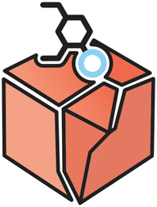

<p align="center">
  
</p>

<h1 align="center">Pyrite</h1>

<p align="center">
  <a href="https://github.com/PooleChem/Pyrite/actions/workflows/tests.yml"></a>
  <a href="https://github.com/PooleChem/Pyrite/actions/workflows/docs.yml"></a>
</p>

Pyrite is a Python toolkit for molecular docking: placing a ligand in the binding site of a
receptor, and finding the poses that fit best. It is built from separate pieces that work together
in a docking run, and just as well on their own or with code of your own:

- **Molecules and poses**: ligands and receptors from SDF, PDB or SMILES (through RDKit), and poses
  that place a molecule by its rotation, translation and torsions, one pose or a whole batch.
- **Scoring functions**: terms such as those of AutoDock Vina, combined with ordinary arithmetic,
  scored one pose or many at a time, with analytic gradients, and on precomputed grids for speed.
- **Searches**: binding sites and pockets, starting poses, basin hopping, and clustering of the
  results, or any optimizer of your own.

**Documentation: <https://poolechem.github.io/Pyrite/>**, with a user guide and the API reference.

## Installing

Pyrite is on PyPI as `pyrite-chem`, and needs Python 3.10 or newer:

```bash
pip install pyrite-chem
pip install "pyrite-chem[pdbfixer]"  # also OpenMM and PDBFixer, to prepare receptor PDB files
```

The import name is `pyrite`. Its dependencies (numpy, scipy, numba, RDKit, py3Dmol) come with it.
With conda, they can come from conda-forge instead:

```bash
git clone https://github.com/PooleChem/Pyrite.git
cd Pyrite
conda env create -f doc/environment.yml
conda activate pyrite-docs
pip install -e .
```

On the newest macOS with Python 3.10, SciPy's pip wheels fail to load; use Python 3.11 or newer, or
SciPy from conda-forge.

## An example

Docking a ligand into its receptor, as in the
[Getting started](https://poolechem.github.io/Pyrite/user_guide/getting_started.html) page of the
documentation:

```python
import numpy as np

from pyrite import Mol, Poses
from pyrite.bounds import Pocket, RectangularBounds
from pyrite.cluster import cluster_and_select
from pyrite.io import fix_receptor_pdb
from pyrite.scoring import DistanceToPocket, InternalOverlap, vina_like_grid
from pyrite.search import (
    BasinHopping, adaptive_stepsize, boltzmann_diversity_filter, place_in, random_hop,
)

receptor = Mol.from_pdb(fix_receptor_pdb("receptor.pdb"), hydrogens="add")
ligand = Mol.from_sdf("ligand.sdf", flexible=True)

# The binding site, and a Vina-like scoring function on a grid over it
box = RectangularBounds.autobox(ligand, padding=1.0)
score = vina_like_grid(ligand, receptor, box)

# Starting poses in the pocket, and a basin-hopping search from each
rng = np.random.default_rng(0)
pocket = Pocket.from_mol(receptor).intersect(box, padding=2.0)
placements = place_in(ligand, pocket, n_positions=2000, n_conformations=20, rng=rng)
fit = DistanceToPocket(ligand, pocket) + InternalOverlap(ligand)
starts = boltzmann_diversity_filter(placements, fit.batch_scores(placements), k=32, rng=rng)

hopping = BasinHopping(
    score.get_score_and_gradient,
    random_hop(box.get_translation_bounds()),
    T=1.0,
    stepsize=0.5,
    adapt_stepsize=adaptive_stepsize(),
    minimizer_kwargs={
        "method": "L-BFGS-B",
        "jac": True,
        "bounds": box.get_bounds(ligand.layout),
    },
    rng=rng,
)
results = [hopping.run(pose, niter=50) for pose in starts]

# The best pose of every group of similar poses, saved best first
poses = Poses.from_list([result.x for result in results])
scores = np.array([result.fun for result in results])
best = cluster_and_select(ligand, poses, scores, cutoff=2.0, n_output=5)
ligand.to_sdf("docked.sdf", poses=poses[best])
```

## Contributing

Bug reports, questions and pull requests are welcome: see [CONTRIBUTING.md](CONTRIBUTING.md) for how
to set up a development environment, run the tests, and build the documentation.

## License

Pyrite is free to use, modify and distribute for academic, research and other non-commercial
purposes; modified versions that are distributed must share their source under the same terms.
Commercial use needs a separate license: contact david@poolelab.com. See [LICENSE](LICENSE) for the
full terms.

## Citing Pyrite

If you use Pyrite in your research, please cite it; see [CITATION.cff](CITATION.cff), or "Cite this
repository" on GitHub.
